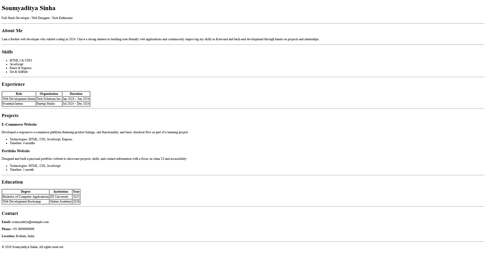

# HTML Resume

## Setup

1. Clone this repository using:
   `git clone https://github.com/ZemonGst/html-resume`

2. Navigate to the repository folder and open the `index.html` file in your web browser.

## Usage

This page presents a straightforward, HTML-only resume featuring sections like About, Skills, Experience, Projects, Education, and Contact.

